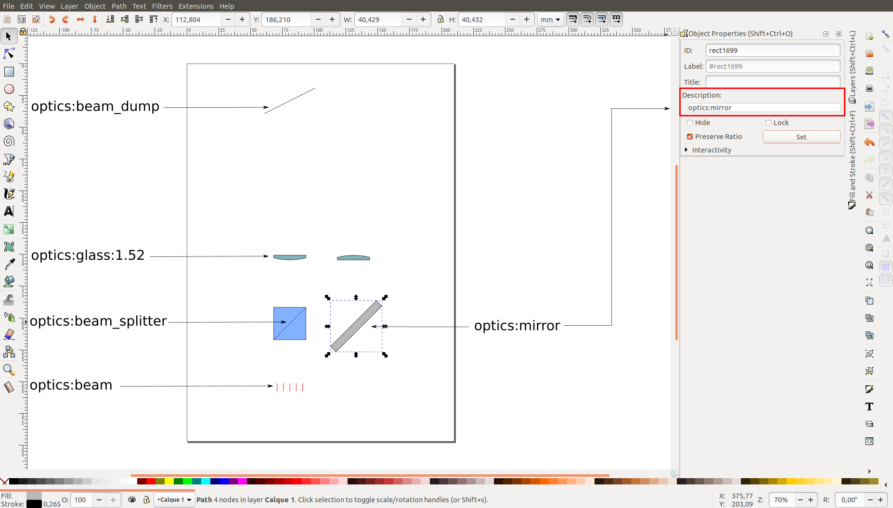
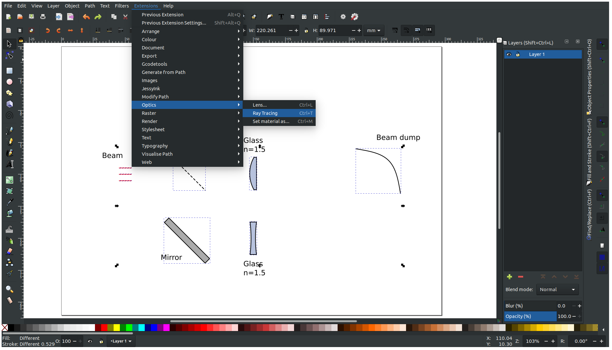
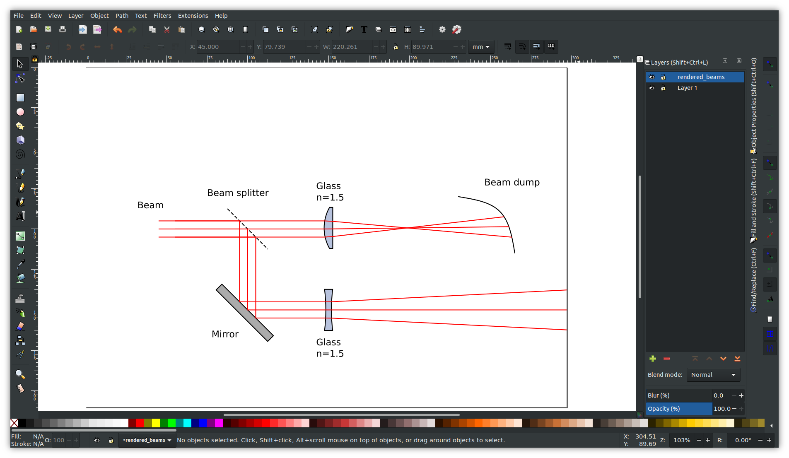

# inkscape-raytracing

## How to install 

Clone the ray tracing directory in inkscape user extensions directory. 

  ```shell
  cd ~/.config/inkscape/extensions
  git clone https://github.com/damienBloch/inkscape-raytracing
  ```
  
Requires python3.6 or above and numpy. 

## How to use

1. For each optical element, write its optical property in the element description:

  

The property that needs to be written in the element description can be any of the following:
  * `optics:beam`: source of the ray. Need at least one element with this property to see an effect. Typically the element should be a straight line.
  * `optics:mirror`: reflects an incoming beam. Element can be a closed or open shape.
  * `optics:beam_dump`: absorbs all incoming beams. Element can be a closed or open shape.
  * `optics:beam_splitter`: for each incoming beam, produces one transmitted beam and one reflected beam. Element can be a closed or open shape.
  * `optics:glass:<optical_index>`: transmits and bends a beam depending on its optical index. Element must be a closed shape.  
  
An element can have at most one optical property and will be ignored if it has two or more.


2. Select the elements to render and run the extension:




3. This will trace all the beams originated from an `optics:beam` element:



Note that the borders of the document blocks the beams and all objects outside the document page will be ignored.


## Limitations

* Avoid overlapping or touching elements. It won't cause Inkscape to crash, but might give unexpected results.
* The same goes for self-intersecting paths.
* Because of a potential issue with Inkscape python extensions, transformations like rotations or reflections are not always correctly applied to groups of elements, rectangles and ellipses. This might cause the ray tracing to output blatantly wrong results or to seemingly ignore some objects. A possible workaround is to ungroup all objects and convert them to path before applying a rotation or reflection. WIP.     
